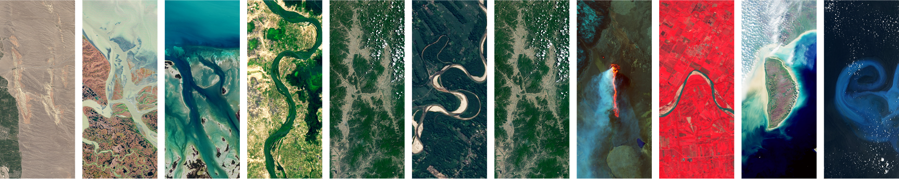

## [Harsh Shinde](http://harshshinde.me/)

<table>
<tr>
<td>
  
-  I’m currently working on remote sensing and its applications.
-  I am an open-source developer with experience in Python, Cloud computing, and geospatial technologies. I’m passionate about continuous learning and enjoy exploring new programming languages and tools in my free time.
-  Beyond coding, I find joy in music and immerse myself in novels that ignite my imagination and creativity.
-  How to reach me: harshinde.hks@gmail.com
-  LinkedIn: https://www.linkedin.com/in/harshshinde/
-  Twitter: https://twitter.com/Harsh_Shinde_/

</td>
<td>

</td>
</tr>
</table>
